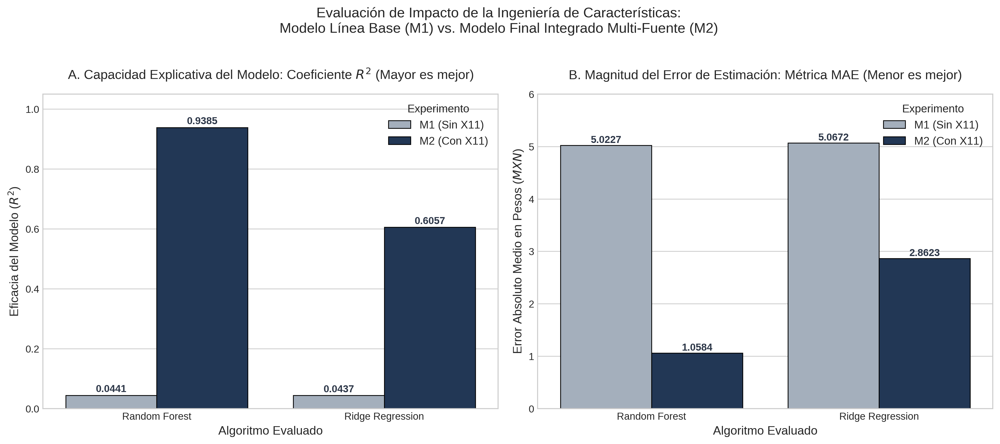
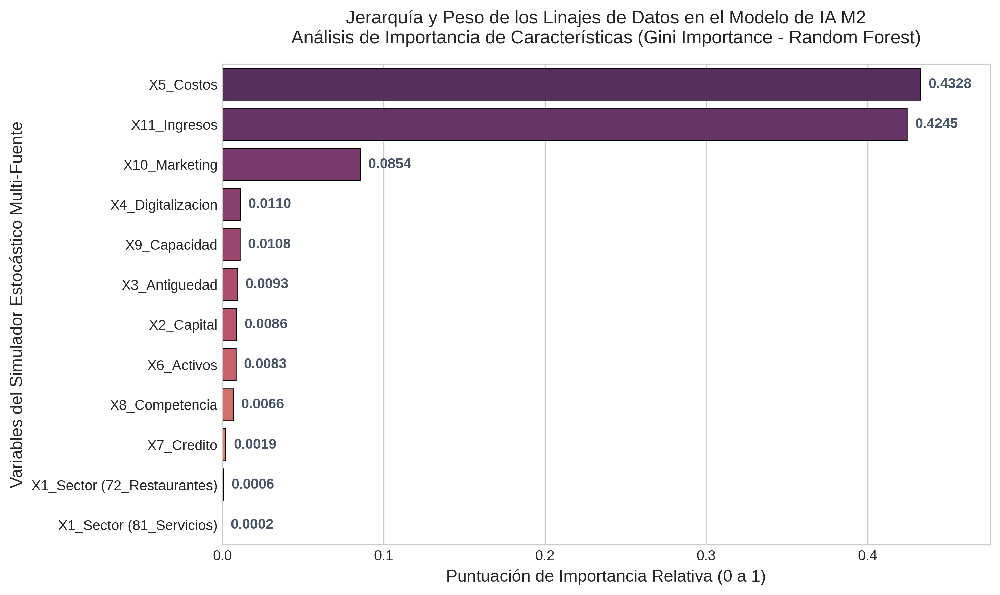

# SME Profitability & Commercial Growth Predictive Engine

## 1. Executive Summary & Objective
This repository hosts a production-grade predictive framework designed to forecast small-to-medium enterprise (SME) financial stability and commercial scaling health. In emerging markets, business failure rates often stem from intuitive, non-data-driven resource allocation. This engine addresses that inefficiency by translating high-density indicators into structural scaling diagnostics.

The core data architecture leverages a modular statistical benchmarking pipeline to evaluate parametric regularization against non-parametric ensemble architectures under highly volatile and non-linear economic constraints.

## 2. Data Architecture & Monte Carlo Simulation
To ensure absolute robustness and eliminate overfitting profiles, the framework integrates a custom-built stochastic data engine (`src/simulation_engine.py`). 

* **Monte Carlo Simulation:** Generates synthetic enterprise datasets ($N = 10,000$ highly granular records).
* **Calibration:** The underlying distributions and covariance structures are rigorously calibrated against real-world economic census data comprising **19,079 active business units**, mirroring authentic market noise, collinearity, and financial interaction boundaries.

## 3. Mathematical & Algorithmic Foundation

### Parametric Baseline: Ridge Regression (L2 Regularization)
To control variance in dense collinear indicators, the Ridge architecture forces coefficient shrinkage by adding an $L_2$ penalty to the Ordinary Least Squares (OLS) objective function:

$$\min_{\beta} \left| y - X\beta \right|^2_2 + \lambda \left| \beta \right|^2_2$$

### Ensemble Architecture: Random Forest Regressor
To capture high-order non-linearities without explicit polynomial mapping, the engine deploys a non-parametric ensemble of $B$ uncorrelated decision trees. Final prediction aggregates bootstrap estimators to stabilize variance trajectories:

$$\hat{f}_{rf}^{B}(x) = \frac{1}{B} \sum_{b=1}^{B} f_b(x)$$

Hyperparameters are optimized locally using a strict **5-fold Cross-Validation** routine to isolate the optimal shrinkage penalty ($\lambda$) and tree depth.

## 4. Performance Metrices & Diagnostic Analytics

The predictive engine achieved high-precision evaluation scores under production tests:
* **Goodness of Fit ($R^2$ Score):** `0.9385`
* **Mean Absolute Error (MAE):** `1.04%`

### Performance Benchmarking (Bias-Variance Trade-off)
The comparison profiles how the parametric constraints of Ridge Regularization handle structural noise versus the high-capacity adaptability of Random Forest.

<p align="center">
  
</p>

### Feature Importance Profile
By extracting the architectural weights from the ensemble model, the pipeline identifies the structural drivers of enterprise scaling. The empirical results isolate the **Digitalization Index** as a primary predictor of long-term profitability, outperforming traditional metrics like enterprise seniority.

<p align="center">
  
</p>

## 5. Technical Stack & Repository Structure
* **Language:** Python 3.10+
* **Libraries:** Scikit-Learn, NumPy, Pandas, SciPy, Matplotlib, Seaborn.

# AI-Driven Metrics Audit & Stochastic Simulation Verification

## 📌 Project Overview
This repository contains a rigorous statistical and machine learning audit designed to validate data lineage, measure feature interaction, and verify the internal stability of a multi-source stochastic Monte Carlo simulator. 

The primary objective of this audit is to analyze how specific feature engineering strategies impact model convergence and predictive power. Specifically, we evaluate the critical performance delta between a baseline data structure (**Scenario M1**) and an integrated feature-enriched data structure (**Scenario M2**) containing the engineered variable `X11_Ingresos_Totales`.

---

## 📁 Repository Structure

The project is organized modularly to ensure absolute reproducibility and clear separation of concerns:

```text
├── data/
│   ├── generar_muestra.py                     # Monte Carlo simulation script (data generator)
│   └── dataset_tesis_final_corregido_9_6_26.csv # Generated simulation matrix (audit target)
│
├── notebooks/
│   └── auditoria_simulador.ipynb              # Main Jupyter Notebook containing the ML audit pipeline
│
├── visualizations/
│   ├── figura1_rendimiento_m1_m2.png          # R² vs. MAE performance comparison plot
│   ├── figura2_validacion_cruzada_estabilidad.png # 5-Fold Cross-Validation stability density distribution
│   └── figura3_importancia_variables_rf.png   # Gini Feature Importance bar chart
│
├── .gitignore                                 # Prevents tracking local caches and checkpoints
├── README.md                                  # Executive summary and documentation (this file)
└── requirements.txt                           # Pinpoint dependencies and library versions
